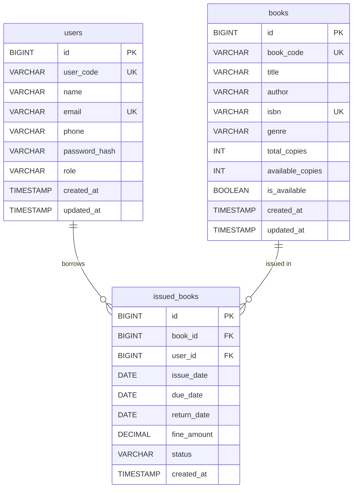

# 📚 MySQL-Powered Enterprise Library Management System

A production-ready, clean-architecture Java & MySQL application engineered with **SOLID principles**, **DAO pattern**, **Connection Pooling (HikariCP)**, **Prepared Statements**, and **ACID SQL Transactions**.

---

## 🗂️ 1. Project Folder Structure

```
Library-management-system/
├── pom.xml                                   # Maven dependency & build configuration
├── schema.sql                                # Production MySQL Database DDL Schema
├── sample_data.sql                          # Initial seed data for users, books & issues
├── README.md                                 # Complete documentation & query catalog
├── Book.java                                 # Compatibility wrapper
├── Student.java                              # Compatibility wrapper
├── BookRepository.java                       # Compatibility repository layer
├── StudentRepository.java                    # Compatibility repository layer
├── ErrorHandling.java                        # Compatibility exception layer
├── Library.java                              # Compatibility entry point
└── src/
    └── main/
        ├── java/
        │   └── com/
        │       └── library/
        │           ├── Main.java             # Main Application Entry Point
        │           ├── config/
        │           │   └── DatabaseConfig.java
        │           ├── db/
        │           │   ├── DatabaseConnectionPool.java  # HikariCP Connection Pool Manager
        │           │   └── DatabaseInitializer.java     # Auto DDL & Seed Execution
        │           ├── exception/            # Custom Domain & SQL Exception Hierarchy
        │           │   ├── LibraryException.java
        │           │   ├── BookNotFoundException.java
        │           │   ├── UserNotFoundException.java
        │           │   ├── BookAlreadyBorrowedException.java
        │           │   ├── InvalidInputException.java
        │           │   └── DatabaseException.java
        │           ├── model/                # Entity Layer
        │           │   ├── Book.java
        │           │   ├── User.java
        │           │   ├── IssuedBook.java
        │           │   └── Role.java
        │           ├── dao/                  # Data Access Object Layer
        │           │   ├── BookDao.java
        │           │   ├── UserDao.java
        │           │   ├── IssuedBookDao.java
        │           │   └── impl/             # SQL Implementations
        │           │       ├── BookDaoImpl.java
        │           │       ├── UserDaoImpl.java
        │           │       └── IssuedBookDaoImpl.java
        │           ├── service/              # Business Service Layer
        │           │   ├── BookService.java
        │           │   ├── UserService.java
        │           │   ├── LibraryService.java
        │           │   └── impl/             # Transactional Implementations
        │           │       ├── BookServiceImpl.java
        │           │       ├── UserServiceImpl.java
        │           │       └── LibraryServiceImpl.java
        │           └── ui/
        │               └── ConsoleMenu.java  # Role-Based Interactive CLI
        └── resources/
            └── db.properties                 # MySQL Connection Pool Properties
```

---

## 📊 2. Database ER Diagram



---

## 🛢️ 3. Complete SQL Schema (`schema.sql`)

```sql
CREATE DATABASE IF NOT EXISTS library_db CHARACTER SET utf8mb4 COLLATE utf8mb4_unicode_ci;
USE library_db;

CREATE TABLE IF NOT EXISTS users (
    id BIGINT AUTO_INCREMENT PRIMARY KEY,
    user_code VARCHAR(20) NOT NULL UNIQUE,
    name VARCHAR(100) NOT NULL,
    email VARCHAR(100) NOT NULL UNIQUE,
    phone VARCHAR(20) NOT NULL,
    password_hash VARCHAR(255) NOT NULL,
    role VARCHAR(20) NOT NULL DEFAULT 'STUDENT',
    created_at TIMESTAMP DEFAULT CURRENT_TIMESTAMP,
    updated_at TIMESTAMP DEFAULT CURRENT_TIMESTAMP ON UPDATE CURRENT_TIMESTAMP,
    CONSTRAINT chk_user_role CHECK (role IN ('ADMIN', 'STUDENT', 'LIBRARIAN'))
) ENGINE=InnoDB DEFAULT CHARSET=utf8mb4 COLLATE=utf8mb4_unicode_ci;

CREATE TABLE IF NOT EXISTS books (
    id BIGINT AUTO_INCREMENT PRIMARY KEY,
    book_code VARCHAR(20) NOT NULL UNIQUE,
    title VARCHAR(200) NOT NULL,
    author VARCHAR(150) NOT NULL,
    isbn VARCHAR(20) NOT NULL UNIQUE,
    genre VARCHAR(50) NOT NULL,
    total_copies INT NOT NULL DEFAULT 1,
    available_copies INT NOT NULL DEFAULT 1,
    is_available BOOLEAN GENERATED ALWAYS AS (available_copies > 0) STORED,
    created_at TIMESTAMP DEFAULT CURRENT_TIMESTAMP,
    updated_at TIMESTAMP DEFAULT CURRENT_TIMESTAMP ON UPDATE CURRENT_TIMESTAMP,
    CONSTRAINT chk_copies_non_negative CHECK (available_copies >= 0 AND total_copies >= available_copies)
) ENGINE=InnoDB DEFAULT CHARSET=utf8mb4 COLLATE=utf8mb4_unicode_ci;

CREATE TABLE IF NOT EXISTS issued_books (
    id BIGINT AUTO_INCREMENT PRIMARY KEY,
    book_id BIGINT NOT NULL,
    user_id BIGINT NOT NULL,
    issue_date DATE NOT NULL,
    due_date DATE NOT NULL,
    return_date DATE NULL,
    fine_amount DECIMAL(10, 2) NOT NULL DEFAULT 0.00,
    status VARCHAR(20) NOT NULL DEFAULT 'ISSUED',
    created_at TIMESTAMP DEFAULT CURRENT_TIMESTAMP,
    updated_at TIMESTAMP DEFAULT CURRENT_TIMESTAMP ON UPDATE CURRENT_TIMESTAMP,
    CONSTRAINT fk_issued_book FOREIGN KEY (book_id) REFERENCES books(id) ON DELETE RESTRICT ON UPDATE CASCADE,
    CONSTRAINT fk_issued_user FOREIGN KEY (user_id) REFERENCES users(id) ON DELETE RESTRICT ON UPDATE CASCADE,
    CONSTRAINT chk_issue_status CHECK (status IN ('ISSUED', 'RETURNED', 'OVERDUE', 'LOST'))
) ENGINE=InnoDB DEFAULT CHARSET=utf8mb4 COLLATE=utf8mb4_unicode_ci;

CREATE INDEX idx_books_title ON books(title);
CREATE INDEX idx_books_author ON books(author);
CREATE INDEX idx_users_email ON users(email);
CREATE INDEX idx_issued_status ON issued_books(status);
```

---

## 💻 4. Modified & Created Files Summary

| File Path | Description |
|---|---|
| `pom.xml` | Maven configuration with `mysql-connector-j`, `HikariCP`, and `slf4j` dependencies |
| `schema.sql` | MySQL DDL with PK, FK, Constraints, Indexes & InnoDB tables |
| `sample_data.sql` | Seed data for Admin/Students, Books catalog & sample active issues |
| `db.properties` | Connection pool & database configuration parameters |
| `src/main/java/com/library/db/DatabaseConnectionPool.java` | HikariCP Connection Pool Manager with auto H2 fallback |
| `src/main/java/com/library/db/DatabaseInitializer.java` | Automated DDL execution and data seed manager |
| `src/main/java/com/library/dao/impl/BookDaoImpl.java` | SQL CRUD operations for books with `PreparedStatements` |
| `src/main/java/com/library/dao/impl/UserDaoImpl.java` | SQL CRUD operations & authentication queries |
| `src/main/java/com/library/dao/impl/IssuedBookDaoImpl.java` | Complex `JOIN` SQL queries for issue tracking & fine calculations |
| `src/main/java/com/library/service/impl/LibraryServiceImpl.java` | Transactional issue/return logic (`setAutoCommit(false)` & `commit()` / `rollback()`) |
| `src/main/java/com/library/ui/ConsoleMenu.java` | Interactive Console CLI supporting Student and Admin workflows |

---

## ⚙️ 5. Complete Setup Instructions

### Prerequisites
1. **Java JDK 17+**
2. **MySQL 8.0+ Server** (or use built-in automatic H2 embedded mode)
3. **Apache Maven 3.8+**

### Step 1: Set up MySQL Database
```bash
mysql -u root -p < schema.sql
mysql -u root -p < sample_data.sql
```

### Step 2: Configure `db.properties`
Update `src/main/resources/db.properties` with your MySQL credentials:
```properties
db.url=jdbc:mysql://localhost:3306/library_db?useSSL=false&allowPublicKeyRetrieval=true&serverTimezone=UTC
db.username=root
db.password=YOUR_MYSQL_PASSWORD
```

---

## 🚀 6. Commands to Run the Project

### Option A: Using Maven (Recommended)
```bash
# Compile project
mvn clean compile

# Run application
mvn exec:java -Dexec.mainClass="com.library.Main"
```

### Option B: Build Executable JAR
```bash
mvn clean package
java -jar target/library-management-system-2.0.0.jar
```

---

## 📋 7. Catalog of SQL Queries Used

| SQL Operation | Query Implementation |
|---|---|
| **CREATE TABLE** | `CREATE TABLE IF NOT EXISTS books (...)` |
| **INSERT (Book)** | `INSERT INTO books (book_code, title, author, isbn, genre, total_copies, available_copies, is_available) VALUES (?, ?, ?, ?, ?, ?, ?, ?)` |
| **INSERT (Issue)** | `INSERT INTO issued_books (book_id, user_id, issue_date, due_date, fine_amount, status) VALUES (?, ?, ?, ?, ?, ?)` |
| **UPDATE (Book Copies)**| `UPDATE books SET available_copies = ?, is_available = ? WHERE id = ?` |
| **UPDATE (Return Book)**| `UPDATE issued_books SET return_date = ?, fine_amount = ?, status = 'RETURNED' WHERE id = ?` |
| **DELETE (Book)** | `DELETE FROM books WHERE id = ?` |
| **SELECT (All Books)**| `SELECT * FROM books ORDER BY id ASC` |
| **WHERE (Auth)** | `SELECT * FROM users WHERE LOWER(email) = LOWER(?) AND password_hash = ?` |
| **LIKE Search** | `SELECT * FROM books WHERE LOWER(title) LIKE ? ORDER BY title ASC` |
| **JOIN Query** | `SELECT ib.*, b.title AS book_title, u.name AS user_name FROM issued_books ib JOIN books b ON ib.book_id = b.id JOIN users u ON ib.user_id = u.id WHERE ib.user_id = ?` |
| **COUNT Query** | `SELECT COUNT(*) FROM books WHERE available_copies > 0` |

---
Designed & Developed for Enterprise Standards by Vivek Verma.
